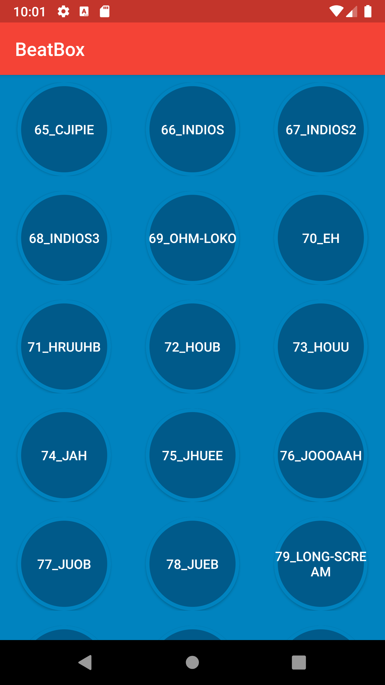

# BeatBox

- an app that holds sounds inside a grid view.

### Concepts:

- MVVM
- DataBinding
- RecyclerView
- Raw assets with Sounds
- AssetManager
- SoundPool
- Observables -> master branch
- LiveData and Binding Adapter Samples -> livedata branch
- Mockito

### Images:

